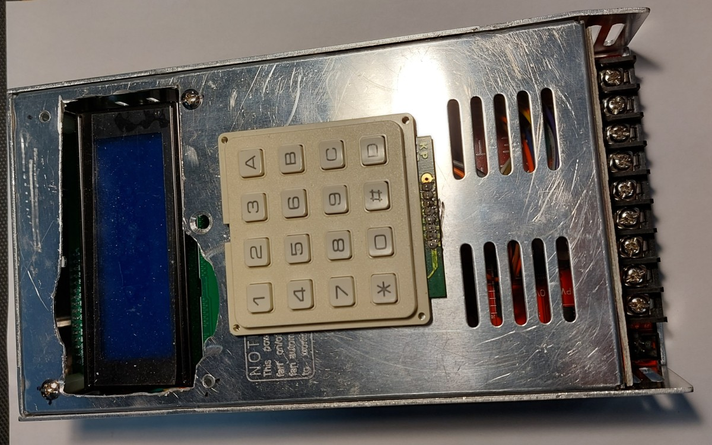

# Oven Control System

Our team's generic composite oven controller. Used to maintain a desired two-step curing 
cycle recommended for the majority of our composites. Each step is defined with a target 
temperature, a ramp speed to reach it at (e.g. 2 degC/minute), and hold time at that 
temperature.

The control system is pretty simple, a single K-type thermocouple is used to monitor the 
temperature in the oven, and a simple "ON/OFF" scheme is used to operate the relay that 
controls the power to the heater. Turning ON when below a threshold, and then OFF once 
the upper threshold is surpassed.

User input is handled by a 16 button keypad, with a 20 by 4 character LCD screen used for 
feedback to the user to inform them of their input, and the current state of the oven.

## Code

With the exception of the display code (under "libraries") all the code was written by hand 
in the Arduino IDE. The main firmware is `oven_system` which is written for an Arduino Nano.

It was previously modified to include logging capabilities (`oven_system_with_logging`), 
and another version to operate using the serial interface for input/output in the absence 
of a keybad and/or a screen (`oven_system_no_display`). ***These variants have not been 
maintained to include recent improvements to the main code!***

In addition to the main code, we also prepared unit tests for each piece of hardware we were 
introducing to the system. In these we wrote the code needed to interact with each part as 
well as running some basic tests to exercise both the code and component. These are all in 
the "unit_tests" folder.

## Hardware

The current design is a small circuit board which has the ATmega328P microcontroller and 
the MAX6675 thermocouple chip. The microcontroller is set up to be programmed just like 
an Arduino Nano. Off board is the solid state relay used to regulate the heater, the 5V 
supply, keypad, and screen. This is all housed in a metal case repurposed from a failed 
power supply, with the terminal block used to connect the thermocouple, power, and heater.

The current board was designed in KiCad 6, however my previous versions were designed in 
EAGLE. The most notable differences through iterations are:

- Embedding of the microcontroller and the MAX6675 directly to the main board
- Removal of the logging functionality since it was not used
- The earliest versions were designed to use thermistors instead of a thermocouple
- Previous designs weren't designed to fit in any particular enclosure

## TODO

A small to-do list of future features that could improve the system.

- [ ] Add some system to allow for recovery if power is interrupted
- [ ] Add some system to allow the system to be reset if needed
- [x] Figure out why SPI programming doesn't work if the MAX6675 is connected in any way
    - This was due to the MAX6675 not having a pullup on nCS, so it was active during programming of the ATmega and interfered on the SPI bus.
    - This **should** be revised in future hardware revisions
